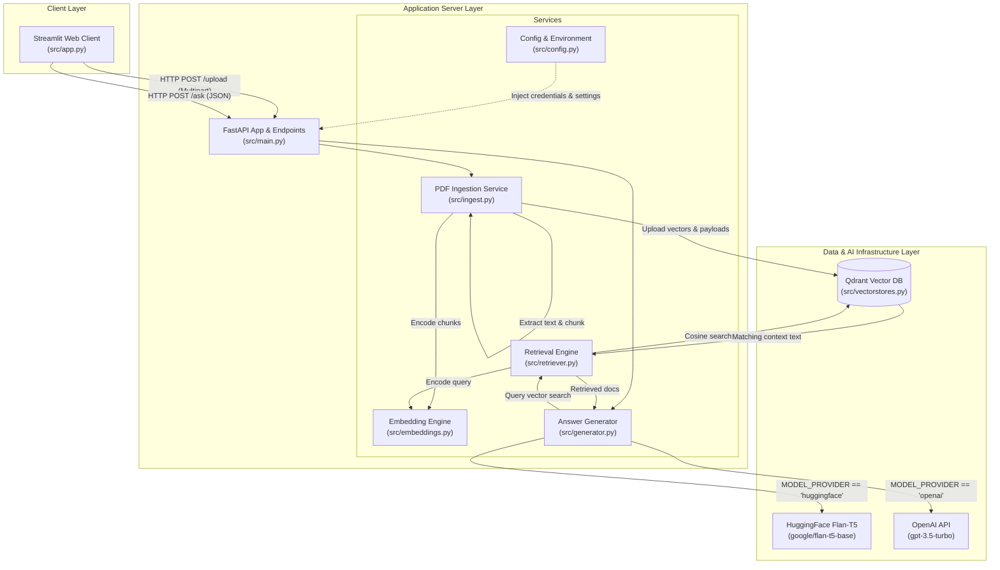
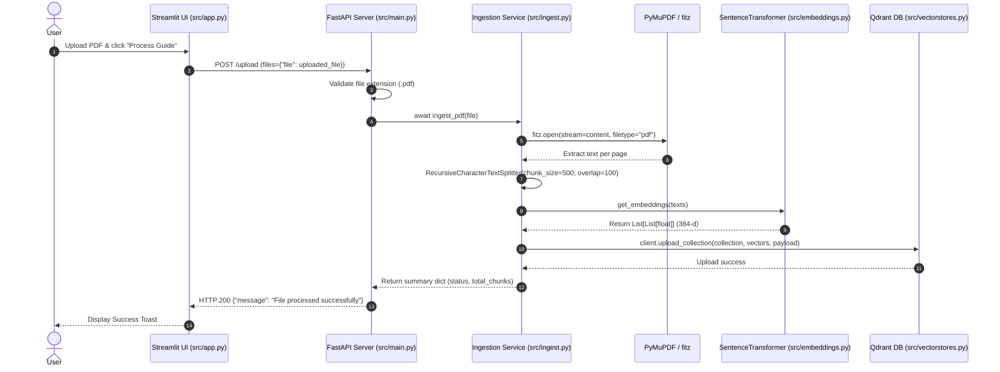
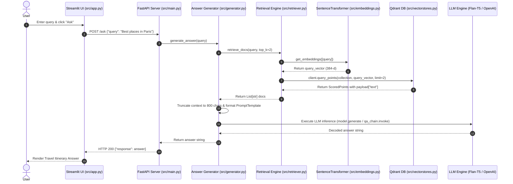

# High-Level Design (HLD) — AI Travel Assistant

## 1. System Architecture Context Diagram

The AI Travel Assistant is constructed as a decoupled two-tier micro-service system (Streamlit Frontend + FastAPI Backend) backed by a vector database engine (Qdrant) and LLM inference providers (HuggingFace Transformers / OpenAI API).



---

## 2. Component Responsibilities

| Component | Source File | Core Responsibilities |
|---|---|---|
| **Web Frontend** | [`src/app.py`](file:///c:/Users/Admin/Desktop/AI%20-travel-assistant/src/app.py) | Provides interactive Streamlit UI, renders PDF file upload form in sidebar, handles user question input, and formats response messages. |
| **API Web Server** | [`src/main.py`](file:///c:/Users/Admin/Desktop/AI%20-travel-assistant/src/main.py) | Implements FastAPI web application framework, defines `POST /upload`, `POST /ask`, and `GET /` endpoints, manages async lifespan database initialization hooks. |
| **Document Ingestor** | [`src/ingest.py`](file:///c:/Users/Admin/Desktop/AI%20-travel-assistant/src/ingest.py) | Stream-reads PDF files using PyMuPDF (`fitz`), splits text into 500-char chunks via `RecursiveCharacterTextSplitter`, calls embedding engine, and stores vectors into Qdrant. |
| **Vector Searcher** | [`src/retriever.py`](file:///c:/Users/Admin/Desktop/AI%20-travel-assistant/src/retriever.py) | Generates dense query vector embeddings, queries Qdrant DB via `query_points`, and extracts payload text strings. |
| **LLM Generator** | [`src/generator.py`](file:///c:/Users/Admin/Desktop/AI%20-travel-assistant/src/generator.py) | Builds PromptTemplate, orchestrates retrieval, truncates context to 800 chars, executes inference via Flan-T5 local pipeline or OpenAI `ChatOpenAI`. |
| **Embedding Engine** | [`src/embeddings.py`](file:///c:/Users/Admin/Desktop/AI%20-travel-assistant/src/embeddings.py) | Wraps `SentenceTransformer('all-MiniLM-L6-V2')` model to produce 384-dimensional floating-point embeddings. |
| **Vector Store Manager** | [`src/vectorstores.py`](file:///c:/Users/Admin/Desktop/AI%20-travel-assistant/src/vectorstores.py) | Manages `QdrantClient` connection instance and initializes vector collection (`VectorParams(size=384, distance=Distance.COSINE)`). |
| **Configuration** | [`src/config.py`](file:///c:/Users/Admin/Desktop/AI%20-travel-assistant/src/config.py) | Loads `.env` environment variables (`QDRANT_HOST`, `QDRANT_API_KEY`, `COLLECTION_NAME`, `OPENAI_API_KEY`, `MODEL_PROVIDER`, `FASTAPI_URL`). |

---

## 3. Data Flow Journeys

### 3.1 Document Upload Journey



### 3.2 Question-Answering & Retrieval Journey



---

## 4. Technology Stack Matrix

| Layer | Component | Technology | Rationale & Selection Criteria |
|---|---|---|---|
| **Frontend** | Interactive Web UI | Streamlit | Rapid prototyping of Python-native data and AI web applications without custom JavaScript/CSS. |
| **Backend API** | REST Microservice | FastAPI + Uvicorn | High-performance asynchronous Python web framework with Pydantic validation and native OpenAPI docs. |
| **PDF Parser** | In-Memory Extractor | PyMuPDF (`fitz`) | Blazing fast C-backed PDF text extraction without needing external OCR dependencies or temporary disk files. |
| **Chunking** | Text Splitter | LangChain Text Splitters | Standardized character-level splitting with overlapping window support (`RecursiveCharacterTextSplitter`). |
| **Embeddings** | Dense Vector Model | `sentence-transformers/all-MiniLM-L6-v2` | Lightweight 384-dimensional model offering ideal trade-off between latency, memory footprint, and semantic quality. |
| **Vector DB** | Vector Storage Engine | Qdrant Cloud / Local | Fast, production-ready vector engine supporting payload metadata indexing and Cosine distance similarity. |
| **LLM Inference** | Language Model Engine | HuggingFace `google/flan-t5-base` / OpenAI `gpt-3.5-turbo` | Flexible dual-mode architecture: offline local inference via PyTorch/Transformers or high-accuracy cloud generation. |

---

## 5. Deployment Architecture & Configuration

### 5.1 Local Service Execution
The application runs as two separate Python processes interacting over HTTP localhost (`http://localhost:8000`):

```powershell
# Backend Server Process (Uvicorn)
.\venv\Scripts\python.exe -m uvicorn src.main:app --reload

# Frontend UI Process (Streamlit)
.\venv\Scripts\python.exe -m streamlit run src/app.py
```

### 5.2 Required Environment Variables (`.env`)
```ini
QDRANT_HOST=https://your-qdrant-cluster-url.qdrant.tech:6333
QDRANT_API_KEY=your_qdrant_api_key_here
COLLECTION_NAME=travel_guides
OPENAI_API_KEY=sk-proj-your_openai_key_here
MODEL_PROVIDER=huggingface
```

---

## 6. Security & Architectural Trade-offs

### 6.1 Security Architecture
- **In-Memory Streaming**: Uploaded PDF files are read directly into memory buffers (`file.read()`) and processed without writing raw sensitive documents to temporary disk storage.
- **Environment Isolation**: API tokens (`QDRANT_API_KEY`, `OPENAI_API_KEY`) are managed entirely through server-side `.env` files and never exposed to the Streamlit client browser.

### 6.2 Key Architectural Decisions
- **PyMuPDF In-Memory Parsing vs Disk Storage**: Keeps ingestion state stateless and clean.
- **Fixed-Window Chunking (500/100) vs Page-Level Indexing**: 500-character chunks ensure granular semantic search while preserving context boundary continuity via 100-character overlap.
- **Dual Model Provider Support**: Allows seamless switching between low-latency local execution (Flan-T5) and high-capability cloud LLMs (GPT-3.5-Turbo) by changing a single configuration key.
