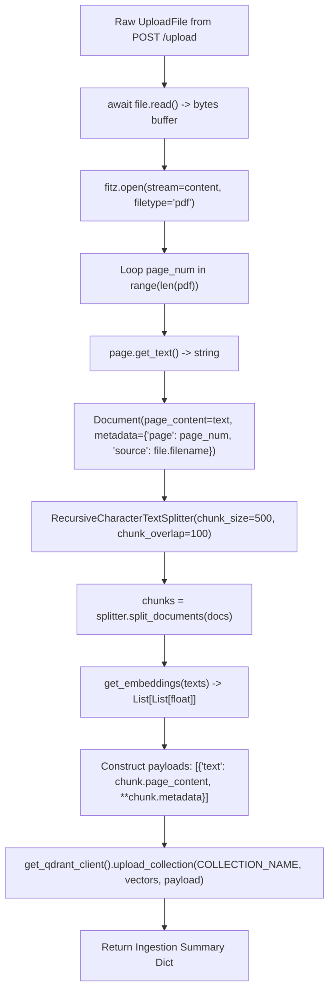
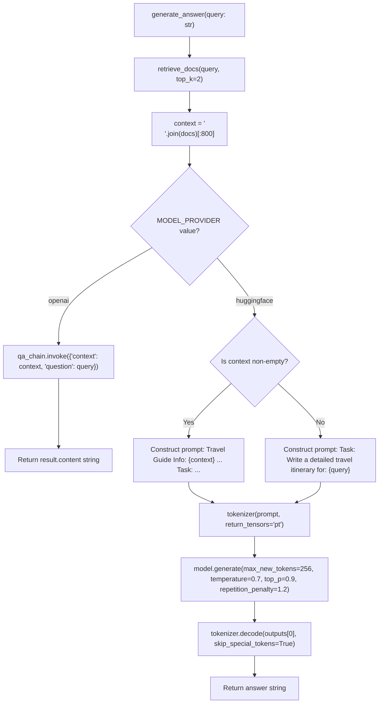

# Low-Level Design (LLD) — AI Travel Assistant

## 1. API Contract Specifications

### 1.1 Endpoint Overview Matrix

| Method | Path | Request Body / Params | Response Body Schema | Status Codes | Auth Required |
|---|---|---|---|---|---|
| `GET` | `/` | None | `{"message": str}` | `200 OK` | No |
| `POST` | `/upload` | Multipart form data: `file: UploadFile` | `{"message": str}` | `200 OK`, `400 Bad Request`, `500 Error` | No |
| `POST` | `/ask` | JSON: `{"query": str}` | `{"response": str}` | `200 OK`, `422 Unprocessable Entity` | No |

---

### 1.2 Endpoint Specifications

#### 1. `GET /`
- **Description**: API health check endpoint verifying FastAPI server status.
- **Handler**: `root()` in [`src/main.py`](file:///c:/Users/Admin/Desktop/AI%20-travel-assistant/src/main.py#L24-L26)
- **Response Schema**:
  ```json
  {
    "message": "AI Travel Assistant API is running"
  }
  ```

#### 2. `POST /upload`
- **Description**: Uploads and ingests a PDF travel guide into Qdrant vector database.
- **Handler**: `upload_file(file: UploadFile)` in [`src/main.py`](file:///c:/Users/Admin/Desktop/AI%20-travel-assistant/src/main.py#L41-L55)
- **Request Content-Type**: `multipart/form-data`
- **Validation**: File presence check (`if not file`) and `.pdf` file extension validation.
- **Success Response Schema (`200 OK`)**:
  ```json
  {
    "message": "File processed successfully"
  }
  ```
- **Error Response Schema (`200 OK` with error description)**:
  ```json
  {
    "message": "Please upload a PDF file"
  }
  ```
  ```json
  {
    "message": "Error processing file: <exception_details>"
  }
  ```

#### 3. `POST /ask`
- **Description**: Queries vector database and returns generated travel itinerary/answers.
- **Handler**: `ask_question(req: QueryRequest)` in [`src/main.py`](file:///c:/Users/Admin/Desktop/AI%20-travel-assistant/src/main.py#L35-L38)
- **Request Schema (`QueryRequest`)**:
  ```json
  {
    "query": "What are the top attractions in Tokyo?"
  }
  ```
- **Success Response Schema (`200 OK`)**:
  ```json
  {
    "response": "Based on the travel guide, top attractions include Senso-ji Temple, Tokyo Tower, and Shibuya Crossing."
  }
  ```

---

## 2. Qdrant Vector Collection & Payload Schema

### 2.1 Collection Configuration
- **Collection Name**: Defined by environment variable `COLLECTION_NAME` (default: `travel_guides`)
- **Vector Dimensions**: `384` (strictly matching `SentenceTransformer('all-MiniLM-L6-V2')`)
- **Distance Metric**: `Distance.COSINE`
- **Initialization Code**: [`src/vectorstores.py`](file:///c:/Users/Admin/Desktop/AI%20-travel-assistant/src/vectorstores.py#L11-L25)

### 2.2 Payload Schema per Point
Each vector point stored in Qdrant contains the following payload fields:

```json
{
  "text": "The Eiffel Tower is a wrought-iron lattice tower on the Champ de Mars in Paris, France...",
  "page": 0,
  "source": "Paris_Travel_Guide.pdf"
}
```

| Field Name | Type | Description |
|---|---|---|
| `text` | `string` | The extracted page text chunk content (up to 500 characters). |
| `page` | `integer` | Zero-indexed page number from the original PDF document. |
| `source` | `string` | Original filename of the uploaded PDF file. |

---

## 3. Detailed Ingestion Pipeline Execution

Implemented in [`src/ingest.py`](file:///c:/Users/Admin/Desktop/AI%20-travel-assistant/src/ingest.py).



### Ingestion Step Breakdown & Code References:
1. **Memory Ingestion**: `fitz.open(stream=content, filetype="pdf")` parses PDF binary without writing disk temporaries ([`src/ingest.py:18`](file:///c:/Users/Admin/Desktop/AI%20-travel-assistant/src/ingest.py#L18)).
2. **Text Extraction**: `page.get_text()` retrieves plain text strings for each page ([`src/ingest.py:24`](file:///c:/Users/Admin/Desktop/AI%20-travel-assistant/src/ingest.py#L24)).
3. **Document Object Creation**: Wrap text into `langchain_core.documents.Document` with `page` and `source` metadata ([`src/ingest.py:25-26`](file:///c:/Users/Admin/Desktop/AI%20-travel-assistant/src/ingest.py#L25-L26)).
4. **Text Chunking**: `RecursiveCharacterTextSplitter(chunk_size=500, chunk_overlap=100)` preserves context sliding windows ([`src/ingest.py:34-35`](file:///c:/Users/Admin/Desktop/AI%20-travel-assistant/src/ingest.py#L34-L35)).
5. **Vector Encoding**: `get_embeddings(texts)` uses SentenceTransformer model `encode()` method to output 384-float vectors ([`src/embeddings.py:6`](file:///c:/Users/Admin/Desktop/AI%20-travel-assistant/src/embeddings.py#L6)).
6. **Vector Batch Upload**: `client.upload_collection(...)` batches vector points and JSON payloads to Qdrant ([`src/ingest.py:48-52`](file:///c:/Users/Admin/Desktop/AI%20-travel-assistant/src/ingest.py#L48-L52)).

---

## 4. Retrieval & Context Window Logic

Implemented in [`src/retriever.py`](file:///c:/Users/Admin/Desktop/AI%20-travel-assistant/src/retriever.py).

### 4.1 Search Execution Flow
1. Receive `query` string and `top_k` parameter (default `top_k=5`, overridden to `top_k=2` in generator).
2. Generate dense query vector:
   ```python
   query_vector = get_embeddings([query])[0]
   ```
3. Execute similarity query on Qdrant:
   ```python
   search_result = client.query_points(
       collection_name=COLLECTION_NAME,
       query=query_vector,
       limit=top_k
   )
   ```
4. Extract text payloads:
   ```python
   return [point.payload["text"] for point in search_result.points if point.payload and "text" in point.payload]
   ```

### 4.2 Context Window Formatting
In [`src/generator.py`](file:///c:/Users/Admin/Desktop/AI%20-travel-assistant/src/generator.py#L41-L43):
- Join top retrieved docs with newline delimiter: `"\n".join(docs)`
- Enforce strict context character window truncation: `context = "\n".join(docs)[:800]`

---

## 5. Generation Logic & Provider Branching

Implemented in [`src/generator.py`](file:///c:/Users/Admin/Desktop/AI%20-travel-assistant/src/generator.py).

### 5.1 Prompt Template Definition
```python
prompt_template = PromptTemplate(
    input_variables=["context", "question"],
    template="""You are a helpful travel assistant.
Use the following travel guide context to answer the question.
If the answer is not found, say you don't know — don’t make it up.

Context:
{context}

Question:
{question}

Answer:"""
)
```

### 5.2 Provider Branching



---

## 6. Error Handling & Failure Mode Matrix

| Scenario / Failure Mode | Exception Source | HTTP Status | Handler Behavior |
|---|---|---|---|
| Non-PDF file uploaded | `src/main.py:46` | `200 OK` | Returns `{"message": "Please upload a PDF file"}` |
| No file attached in upload request | `src/main.py:43` | `200 OK` | Returns `{"message": "No file uploaded"}` |
| Corrupted / Unparseable PDF stream | `src/ingest.py` / PyMuPDF | `200 OK` | Caught in `try-except` block, returns `{"message": "Error processing file: <err>"}` |
| Qdrant host unreachable | `src/vectorstores.py` / `qdrant-client` | `500 Internal Error` | Exception bubbles up or caught by Streamlit UI with error message |
| OpenAI API key invalid / rate limit | `src/generator.py` / `langchain_openai` | `500 Internal Error` | Exception caught by Streamlit try block, displays `Could not reach the FastAPI server` |

---

## 7. Environment & Configuration Schema

Defined in [`src/config.py`](file:///c:/Users/Admin/Desktop/AI%20-travel-assistant/src/config.py):

| Variable Name | Data Type | Default Value | Description |
|---|---|---|---|
| `QDRANT_HOST` | `str` | `os.getenv("QDRANT_HOST")` | Qdrant Cloud cluster endpoint or local host URL |
| `QDRANT_API_KEY` | `str` | `os.getenv("QDRANT_API_KEY")` | Authentication key for Qdrant Cloud service |
| `COLLECTION_NAME` | `str` | `os.getenv("COLLECTION_NAME")` | Name of vector database collection |
| `EMBEDDING_MODEL` | `str` | `"sentence-transformers/all-MiniLM-L6-v2"` | HuggingFace embedding model ID |
| `OPENAI_API_KEY` | `str` | `os.getenv("OPENAI_API_KEY")` | API key for OpenAI Chat API |
| `MODEL_PROVIDER` | `str` | `"huggingface"` | Provider choice (`"huggingface"` or `"openai"`) |
| `FASTAPI_URL` | `str` | `"http://localhost:8000"` | Base URL of FastAPI application server |

---

## 8. Testing Strategy & Verification Guidelines

### 8.1 Verification Blueprint
- **Unit Testing**:
  - `test_embeddings.py`: Test `get_embeddings()` returns 384-d list of floats.
  - `test_ingest.py`: Test chunking output length given sample synthetic document.
  - `test_generator.py`: Test fallback prompt formatting when context is empty.
- **Integration Testing**:
  - `test_api.py`: FastAPI `TestClient` verification of `GET /`, `POST /upload`, and `POST /ask`.
  - `test_qdrant.py`: Connect to local Qdrant instance, verify `init_qdrant()` creates collection with 384 vector size and Cosine distance.
