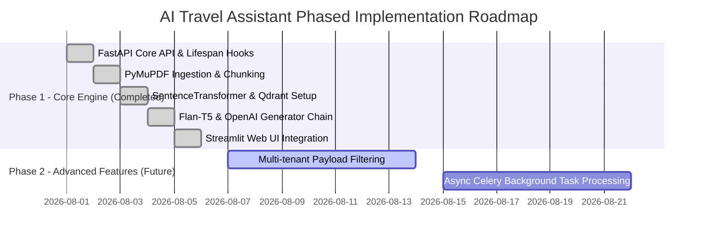

# Product Requirements Document (PRD) — AI Travel Assistant

## 1. Problem Statement, Goals, and Non-Goals

### 1.1 Problem Statement
Travelers frequently struggle to extract actionable, personalized travel itineraries and specific destination facts from lengthy PDF travel guides and brochures. Manually reading through multi-page documents to answer specific questions (e.g., "What are the best places to visit in Paris?") is time-consuming and inefficient.

### 1.2 Goals
- Provide an intuitive web application where users can upload PDF travel guides.
- Ingest and chunk PDF documents, converting text content into dense vector embeddings for semantic indexing.
- Allow users to ask natural language questions about travel destinations.
- Retrieve the most relevant contextual passages from Qdrant vector database and generate concise, accurate answers using LLM technology (HuggingFace Flan-T5 or OpenAI GPT-3.5-Turbo).

### 1.3 Non-Goals
- Real-time booking or flight/hotel reservation integration.
- Multi-user authentication, JWT session management, or access control (currently single-tenant local operation).
- Support for non-PDF document formats (e.g., DOCX, HTML, images).
- Async background job queues or persistent offline worker nodes.

---

## 2. Target Users & User Stories

### 2.1 Target Users
- **Leisure Travelers**: Users looking for quick destination recommendations based on official travel guides.
- **Itinerary Planners**: Users who compile customized daily travel schedules from uploaded brochures.

### 2.2 User Stories Matrix

| ID | As a | I want to | So that |
|---|---|---|---|
| `US-1` | Traveler | Upload a PDF travel guide through the web UI | The assistant can index and search the guide's specific content. |
| `US-2` | Traveler | Ask natural language travel questions (e.g. itinerary recommendations) | I receive instant, accurate answers extracted from my uploaded guide. |
| `US-3` | Traveler | Receive responses generated from LLMs backed by retrieved context | Answers are factual, relevant, and free from hallucinations. |
| `US-4` | System Admin | Configure LLM providers (`huggingface` vs `openai`) via environment variables | The app can run locally offline or leverage cloud APIs flexibly. |

---

## 3. Functional Requirements

### 3.1 Document Ingestion & Vector Indexing (`FR-ING`)
- **`FR-ING-1`**: The system shall accept PDF file uploads via multipart HTTP requests at `POST /upload`.
- **`FR-ING-2`**: The system shall parse PDF content directly in memory using PyMuPDF (`fitz`), iterating through every page.
- **`FR-ING-3`**: The system shall split document text into chunks using `RecursiveCharacterTextSplitter` with a `chunk_size` of 500 characters and `chunk_overlap` of 100 characters.
- **`FR-ING-4`**: The system shall generate dense 384-dimensional vector embeddings for each chunk using the `sentence-transformers/all-MiniLM-L6-v2` model.
- **`FR-ING-5`**: The system shall upload generated vector embeddings and metadata (`text`, `page`, `source`) into the Qdrant vector database collection.

### 3.2 Information Retrieval & Generation (`FR-QA`)
- **`FR-QA-1`**: The system shall accept natural language query strings via JSON payload at `POST /ask`.
- **`FR-QA-2`**: The system shall encode the query string into a 384-d vector and perform a Cosine similarity search against the Qdrant vector store to retrieve `top_k=2` matching text chunks.
- **`FR-QA-3`**: The system shall truncate and format context text to a maximum of 800 characters before prompt injection.
- **`FR-QA-4`**: The system shall construct prompt templates and execute LLM inference via Google Flan-T5 (`google/flan-t5-base`) or OpenAI (`gpt-3.5-turbo`) based on the `MODEL_PROVIDER` setting.

### 3.3 Operations & Infrastructure (`FR-OPS`)
- **`FR-OPS-1`**: The backend shall initialize the Qdrant vector database collection (384 dimensions, Cosine distance) automatically on server startup using FastAPI lifespan hooks.
- **`FR-OPS-2`**: The system shall load environment configuration parameters from a `.env` file via `python-dotenv`.

---

## 4. Non-Functional Requirements

| Category | Requirement Description | Target Metric |
|---|---|---|
| **Performance** | End-to-end Q&A retrieval and generation latency | < 3 seconds (OpenAI) / < 5 seconds (Flan-T5 CPU) |
| **Performance** | PDF processing and embedding throughput | < 2 seconds for a 10-page PDF document |
| **Portability** | System execution across local platforms | Windows / Linux / macOS with Python 3.10+ |
| **Reliability** | File upload input validation | Reject non-PDF file extensions gracefully |
| **Maintainability** | Modular Python architecture | Decoupled files for API, UI, Ingest, Retrieval, Vectorstore, and LLM |

---

## 5. Success Metrics

- **Zero Ingestion Failures**: 100% successful parsing rate for standard vector-capable PDF travel documents.
- **Vector Dimension Alignment**: 100% match between SentenceTransformer output (384 dimensions) and Qdrant collection parameters.
- **Context Fallback Reliability**: Graceful fallback to general itinerary generation when vector database context is empty.
- **Service Uptime**: Clean system boot and lifespan startup without manual database collection initialization.

---

## 6. Phased Milestones

